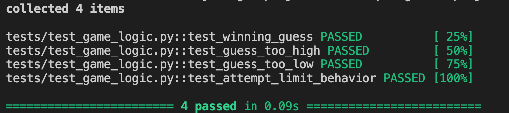

# 🎮 Game Glitch Investigator: The Impossible Guesser

## 🚨 The Situation

You asked an AI to build a simple "Number Guessing Game" using Streamlit.
It wrote the code, ran away, and now the game is unplayable.

- You can't win.
- The hints lie to you.
- The secret number seems to have commitment issues.

## 🛠️ Setup

1. Install dependencies: `pip install -r requirements.txt`
2. Run the broken app: `python -m streamlit run app.py`

## 🕵️‍♂️ Your Mission

1. **Play the game.** Open the "Developer Debug Info" tab in the app to see the secret number. Try to win.
2. **Find the State Bug.** Why does the secret number change every time you click "Submit"? Ask ChatGPT: _"How do I keep a variable from resetting in Streamlit when I click a button?"_
3. **Fix the Logic.** The hints ("Higher/Lower") are wrong. Fix them.
4. **Refactor & Test.** - Move the logic into `logic_utils.py`.
   - Run `pytest` in your terminal.
   - Keep fixing until all tests pass!

## 📝 Document Your Experience

- [x] **Game's Purpose:** A number guessing game built in Streamlit where the player tries to guess a secret number within a limited number of attempts, with hints provided for higher or lower guesses.
- [x] **Bugs Found:**
  - Incorrect hint messages ("Go HIGHER!" vs "Go LOWER!")
  - Attempts counter displayed inconsistently (started lower than allowed, history mismatched)
  - Difficulty ranges not applied for Easy/Hard modes
  - Submit Guess button unresponsive after clicking "New Game"
  - Hint checkbox did not persist or reappear correctly
- [x] **Fixes Applied:**
  - Refactored core logic into `logic_utils.py`
  - Fixed hint logic and numeric comparisons
  - Corrected attempt counting and history tracking
  - Made New Game button fully reset status, attempts, history, and secret number
  - Fixed Show Hint checkbox to persist and toggle correctly
  - Added automated pytest cases for logic and attempt limits

## 📸 Demo

- [x] [Insert a screenshot of your fixed, winning game here]
      

## 🚀 Stretch Features

- [ ] [If you choose to complete Challenge 4, insert a screenshot of your Enhanced Game UI here]
